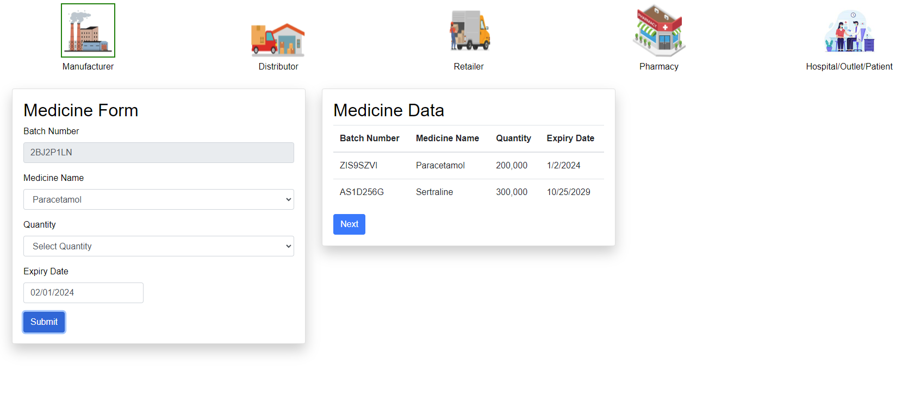
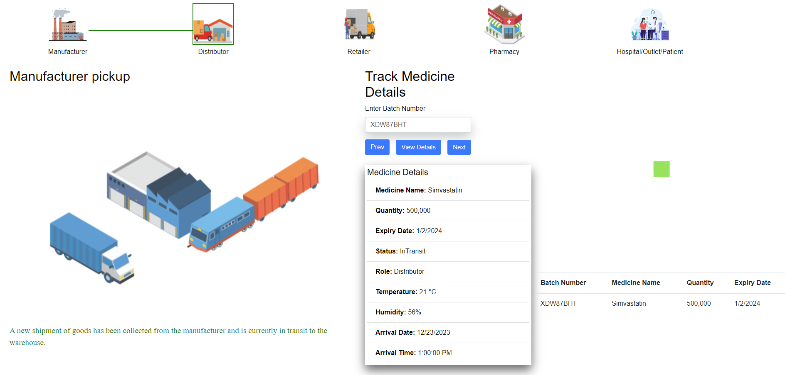
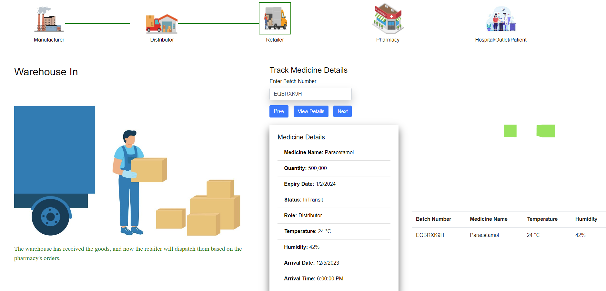
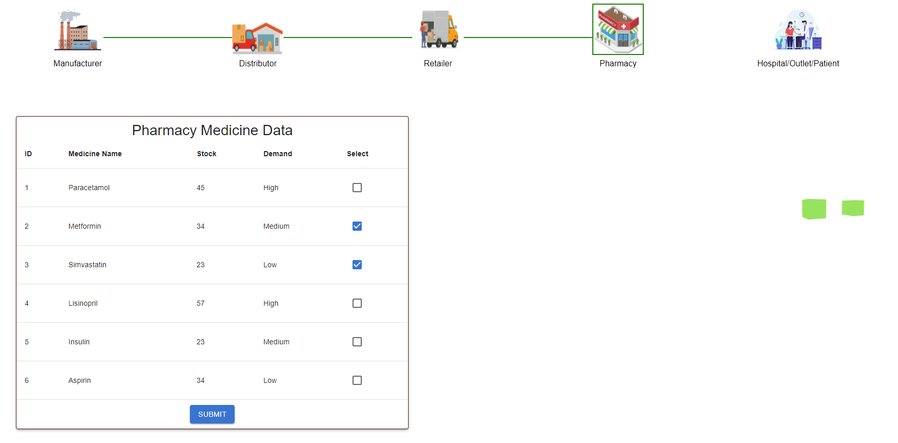
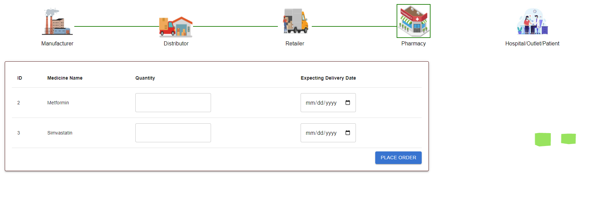
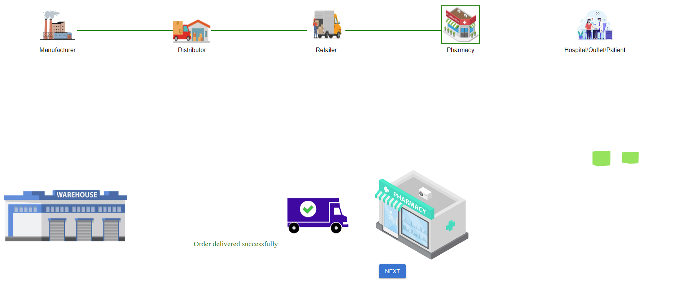
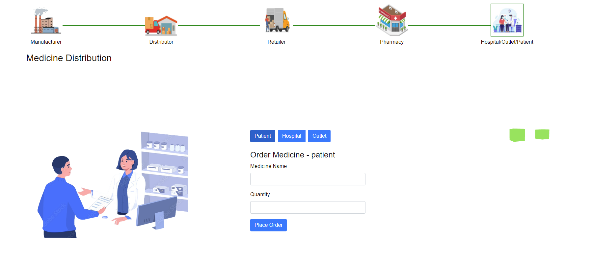
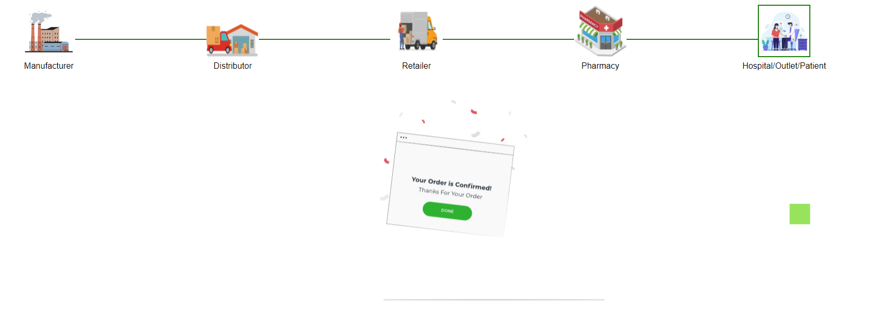

<u><h3>Procedure</h3></u>
 
In this simulation, we will demonstrate Pharmaceutical Supply Chain Simulation with Blockchain. 

 
To demonstrate the application of blockchain in enhancing transparency, traceability, and security in the pharmaceutical supply chain, mitigating the risks associated with the transportation of medicines.

 <b>
1. Shipment of goods 
</b>
 
 Manufacturer initiates the simulation by adding a new set of goods for shipment.
 The blockchain network notifies all relevant entities, including distributors, retailers, pharmacists, and customers.

 
 - 
Choose medicine name , and quantity from the list and set an  expiry date, upon submiting the form ,a table containing the details of the medicine will be visible .
 
 - 
Observe a new block being added to the ledger having all the details of the medicine 

 

 <b>
2.Goods in Transit
</b>
 
 Distributor picks up the goods from the manufacturer.
 During transit, real-time information about the medicine, such as temperature, expiry date, and humidity, is recorded on the blockchain.

 
 - 
Copy paste the batch number for the medicine data table and click on view details will provide details about the medicine . 

  

 <b>
3.Goods Arrival at Warehouse 
</b>
 
Goods reach the warehouse. Warehouse personnel can access current details of the medicine through the blockchain, ensuring transparency and traceability.

 - Copy paste the batch number for the medicine data table and click on view details will provide details about the medicine .
 
 - Observe the blocks being added to the ledger having the details of the medicine  
 
  

 <b>
4.Order Placement:Retailer Stage 
</b>
 
 Retailer checks the current details of the medicine.Pharmacist places an order based on stock and demand.Blockchain records the order transaction.

 
 - 
Choose the medicine that needs to be restocked according to the demand and stock left . 

 
  

 - 
Enter the required quantity of medicine needed, set expecting delivery date , click on the place order button.

   

 <b>
5. Goods Dispatch  from Warehouse
</b>
 
Retailer dispatches the ordered goods to the pharmacy.
Pharmacist checks the details of the medicine through the blockchain before accepting the shipment.

- Clicks on the next button to proceed to the next stage of the process.
- Observe the blocks being added to the ledger and the corresponding changes in the ledger as the pharmacist places an order and goods are dispatched, observe a reduction in the total medicine quantity in the warehouse, reflecting the sale to the pharmacy.
 

<b>
6.Order Placement:Customer Stage
</b>

Customers receive notifications and place orders. Blockchain records the order transactions.

- Click on any of the options given and enter the medicine name and its quantity.
 

<b>
 Completion & Key Benefits And Outcome:
</b>
 

- 
The simulation concludes once the medicine successfully passes through each stage.

- 
Each transaction adds a block to the blockchain ledger, providing a tamper-proof record of the entire supply chain process.

- <b>
Enhanced Traceability:</b> Blockchain ensures a transparent and traceable record of the medicine's journey.

- 
<b>Improved Temperature Control:</b> Real-time monitoring of temperature during transportation.

- 
<b>Tamper-Proof Records:</b> Every transaction is securely recorded on the blockchain, preventing unauthorized alterations.
