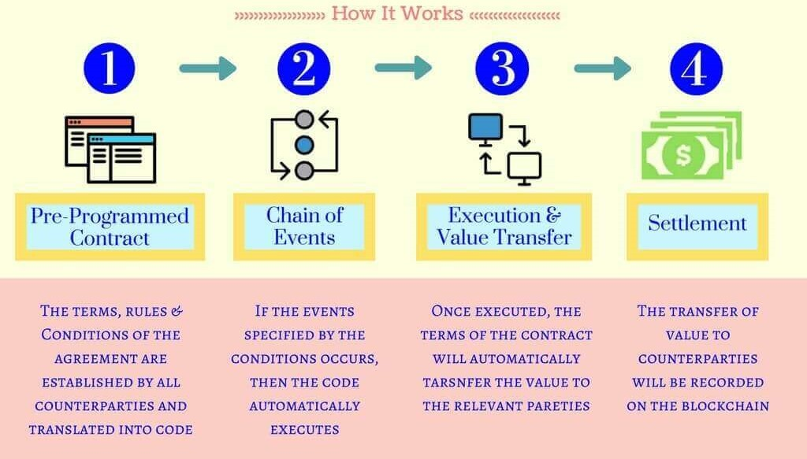

<u><h3>Theory</h3></u>
<b>
 Smart contract
</b>

<b>Traditional contracts:</b> These are written agreements between two or more parties, outlining rights, obligations, and consequences. They rely on trust, legal systems, and intermediaries like lawyers for enforcement.

<b>Smart contracts:</b> Smart contracts are computer programs that are hosted and executed on a blockchain network. Each smart contract consists of code specifying predetermined conditions that, when met, trigger outcomes. By running on a decentralised blockchain instead of a centralised server, smart contracts allow multiple parties to come to a shared result in an accurate, timely, and tamper-proof manner.

 

 
Smart contracts have the potential to revolutionise a wide range of industries, including supply chain management, financial services, and healthcare.

<b>IBM, Honeywell, and Walmart</b> are three of the world's leading companies that are using smart contracts in real-world applications. 

<h3>A comparative analysis of smart contract use cases across IBM, Honeywell, and Walmart
</h3>

| Company | Use Case | Challenge |Smart contract solution | Benefits|
| :---: | :---: | :---: | :---: | :---: |
| IBM  |IBM Food Trust |Ensuring food safety and traceability |Smart contracts track food provenance from farm to table|Reduces food waste, enhances consumer trust |
|| IBM Blockchain Platform|Automating financial transaction|Smart contracts execute financial transactions securely and efficiently|Reduces costs, improves transaction speed|
||IBM Hyperledger Fabric|Managing patient data and medical records|Smart contracts maintain patient data privacy and facilitate secure record sharing|Enhances patient care, improves healthcare outcomes|
|Honeywell|Honeywell GoDirect Trade|Automating invoice processing for aerospace and defence customers|Smart contracts automate invoice creation, payment approvals, and payment execution|Reduces processing time, improves cash flow|
||Honeywell Connected Worker|Managing contract lifecycle for connected worker solutions|Smart contracts track contract terms, automate notifications, and enforce compliance|Enhances contract management efficiency, reduces disputes|
||Honeywell Traceability Solutions|Tracking goods movement from suppliers to customers|Smart contracts track goods location, status, and ownership|Improves supply chain visibility, reduces risks|
|Walmart|Walmart Food Safety and Traceability|Ensuring food safety and reducing food waste|Smart contracts track food provenance and identify potential contamination risks|Enhances food safety, reduces food waste|
||Walmart Blockchain Freight Pilot|Optimising freight routing and reducing fuel consumption|Smart contracts track freight location, optimise routes, and automate payments|Improves logistics efficiency, reduces fuel costs|
||Open-source blockchain contribution|Promoting open standards and collaboration|Smart contracts are open-source,contributing to industry standards|Enhances blockchain ecosystem development, promotes interoperability| 

 We have developed a usecase on Secure and Transparent Pharmaceutical Supply Chain with Blockchain

Problem: Medicine transport is complicated and can expose patients to fake drugs or spoiled medicine, costing money and harming people.

- 
<b>Providing a tamper-proof record of every transaction:</b> This allows all parties involved in the supply chain to track and verify the authenticity of pharmaceuticals, from manufacturing to dispensing.

- 
<b>Enhancing traceability:</b> With blockchain, it is possible to trace the origin of a pharmaceutical product and identify its location at all times. This enables authorities to quickly identify and isolate counterfeit drugs and respond to product recalls.

- 
<b>Improving temperature control:</b> Blockchain can be used to monitor the temperature of pharmaceuticals in real-time, ensuring that they are stored and transported within safe limits.

- 
<b>Identifying potential shortages:</b> By analysing real-time inventory data, potential shortages can be predicted and addressed proactively. This allows manufacturers to adjust production schedules and distributors to optimise stock allocation.

- 
<b>Preventing overstocking:</b> With accurate insights into demand and supply, overstocking situations can be avoided, reducing unnecessary costs and potential waste.

- 
<b>Streamlined communication:</b> Blockchain-based platforms enable efficient communication between manufacturers, distributors, healthcare providers, and regulatory authorities, ensuring timely information exchange and coordinated actions.

- 
<b>Faster decision-making:</b> With access to comprehensive and up-to-date data, stakeholders can make informed decisions faster, responding to surging demand with agility and adaptability.

