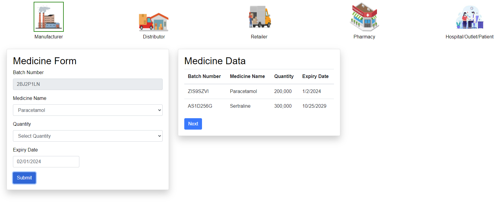
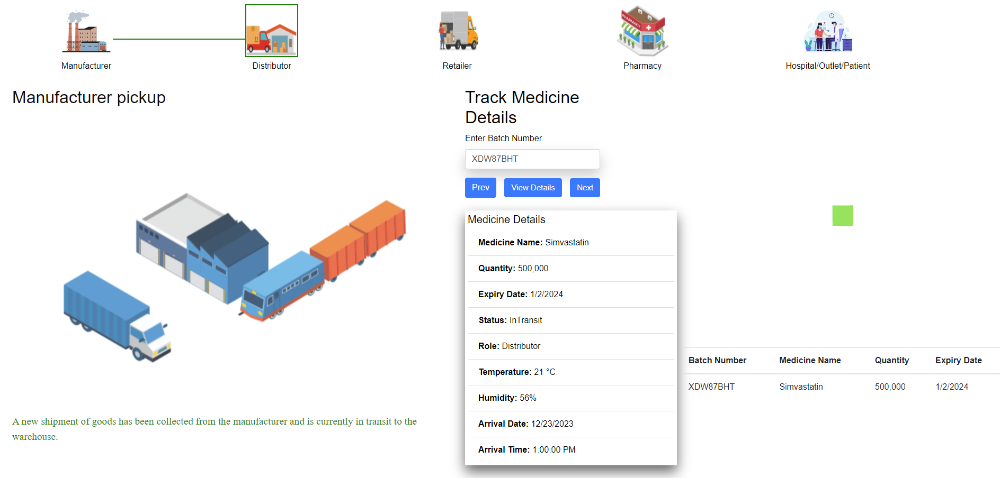
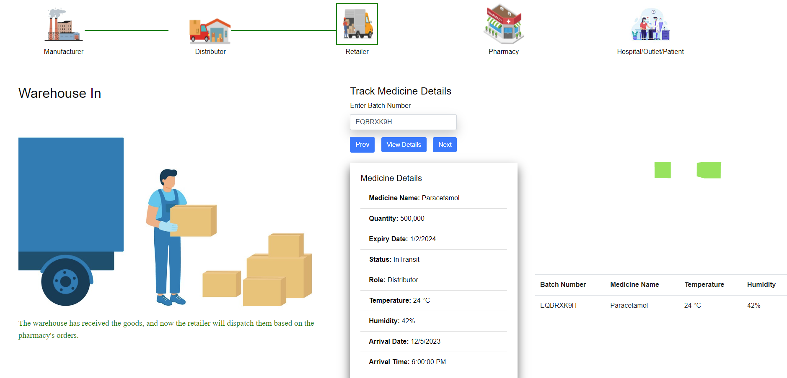
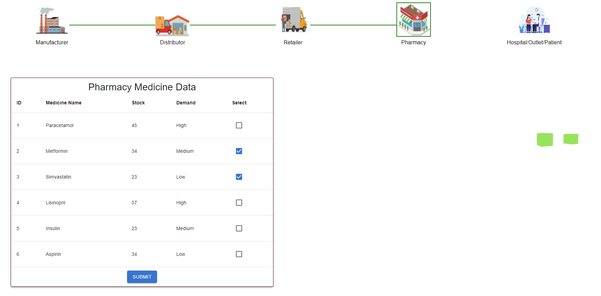
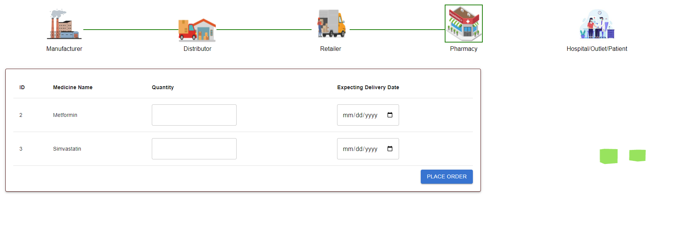
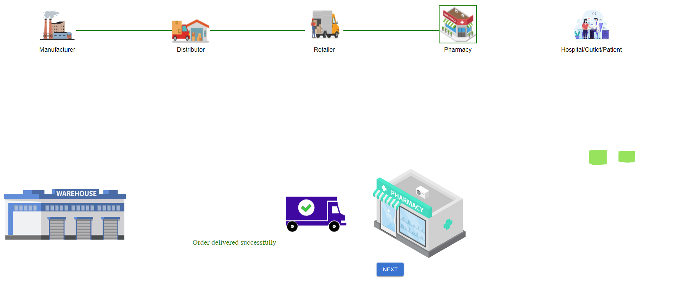
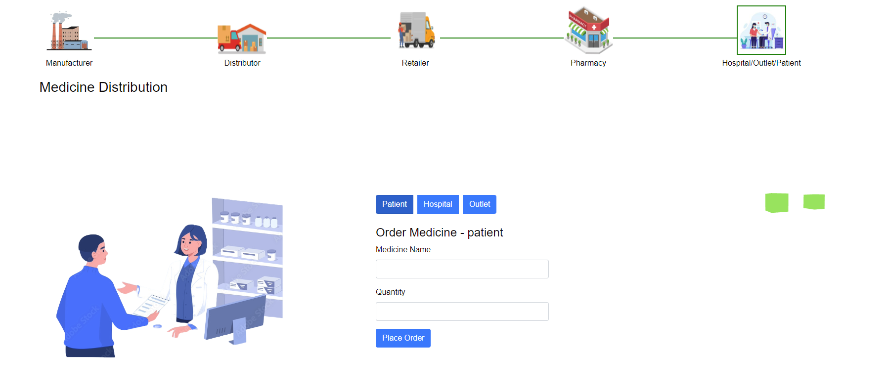
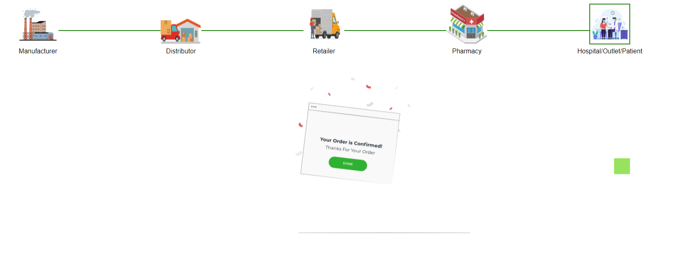

<h3>Procedure</h3>

In this simulation, we will demonstrate <strong>Pharmaceutical Supply Chain Simulation with Blockchain</strong>.

To demonstrate the application of blockchain in enhancing transparency, traceability, and security in the pharmaceutical supply chain, mitigating the risks associated with the transportation of medicines.

<h4>1. Shipment of Goods</h4>

The manufacturer initiates the simulation by adding a new set of goods for shipment.

The blockchain network notifies all relevant entities, including distributors, retailers, pharmacists, and customers.

<ul>
    <li>Choose <strong>medicine name</strong> and <strong>quantity</strong> from the list and set an <strong>expiry date</strong>. Upon submitting the form, a table containing the details of the medicine will be visible.</li>
    <li>Observe a new <strong>block being added</strong> to the ledger containing all the details of the medicine.</li>
</ul>

<h4>2. Goods in Transit</h4>

The distributor picks up the goods from the manufacturer.

During transit, real-time information about the medicine, such as <strong>temperature, expiry date, and humidity</strong>, is recorded on the blockchain.

<ul>
    <li>Copy and paste the <strong>batch number</strong> from the medicine data table and click on <strong>View Details</strong> to get detailed information about the medicine.</li>
</ul>

<h4>3. Goods Arrival at Warehouse</h4>

Goods reach the warehouse. Warehouse personnel can access current details of the medicine through the blockchain, ensuring <strong>transparency and traceability</strong>.

<ul>
    <li>Copy and paste the <strong>batch number</strong> from the medicine data table and click on <strong>View Details</strong> to get information about the medicine.</li>
    <li>Observe the <strong>blocks being added</strong> to the ledger containing the details of the medicine.</li>
</ul>

<h4>4. Order Placement: Retailer Stage</h4>

The retailer checks the current details of the medicine.

The pharmacist places an order based on <strong>stock and demand</strong>, and the blockchain records the transaction.

<ul>
    <li>Choose the <strong>medicine that needs to be restocked</strong> according to demand and available stock.</li>
</ul>

<ul>
    <li>Enter the required <strong>quantity of medicine</strong>, set the <strong>expected delivery date</strong>, and click on the <strong>Place Order</strong> button.</li>
</ul>

<h4>5. Goods Dispatch from Warehouse</h4>

The retailer dispatches the ordered goods to the pharmacy.

The pharmacist checks the details of the medicine through the blockchain before accepting the shipment.

<ul>
    <li>Click the <strong>Next</strong> button to proceed to the next stage of the process.</li>
    <li>Observe the <strong>blocks being added</strong> to the ledger and the corresponding <strong>changes in the ledger</strong> as the pharmacist places an order and goods are dispatched.</li>
    <li>Observe the <strong>reduction in total medicine quantity</strong> in the warehouse, reflecting the sale to the pharmacy.</li>
</ul>

<h4>6. Order Placement: Customer Stage</h4>

Customers receive notifications and place orders. The blockchain records the order transactions.

<ul>
    <li>Click on any of the available options and enter the <strong>medicine name and quantity</strong>.</li>
</ul>

<h4>Completion & Key Benefits and Outcomes</h4>

<ul>
    <li>The simulation concludes once the medicine successfully passes through each stage.</li>
    <li>Each transaction <strong>adds a block</strong> to the blockchain ledger, providing a <strong>tamper-proof record</strong> of the entire supply chain process.</li>
    <li><strong>Enhanced Traceability:</strong> Blockchain ensures a <strong>transparent and traceable</strong> record of the medicine’s journey.</li>
    <li><strong>Improved Temperature Control:</strong> Real-time <strong>monitoring of temperature</strong> during transportation.</li>
    <li><strong>Tamper-Proof Records:</strong> Every transaction is <strong>securely recorded</strong> on the blockchain, preventing unauthorized alterations.</li>
</ul>
