
In this simulation, we will demonstrate the Pharmaceutical Supply Chain Simulation with Blockchain. 

This simulation showcases the application of blockchain in enhancing transparency, traceability, and security in the pharmaceutical supply chain, mitigating the risks associated with the transportation of medicines.

Click the 'Start Simulation' button to start the Pharmaceutical Supply Chain Simulation.

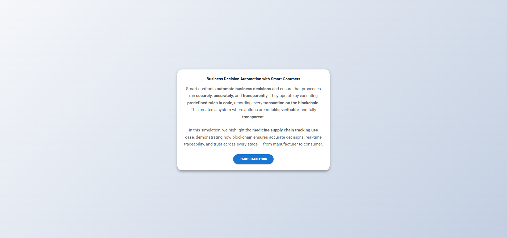

<b>
1. Manufacturer
</b>

The Manufacturer initiates the simulation by adding a new set of medicines for shipment.  

- 
Click the 'Add Medicine' button and fill in the details of the new medicine. Once the medicine name, batch ID, quantity, and expiry date are entered, click the 'Add Medicine' button to manufacture the medicine.

  
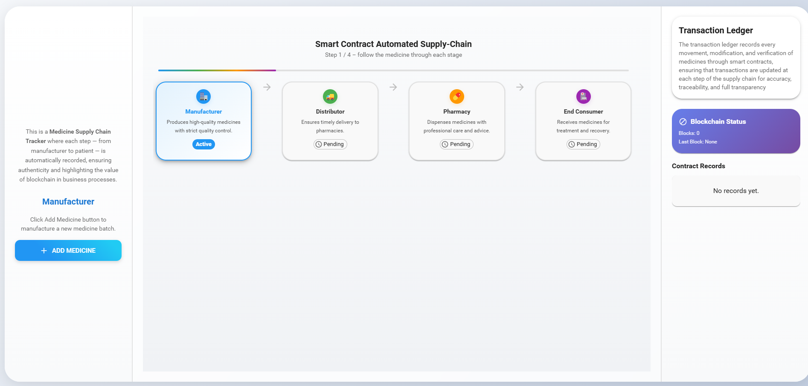

  
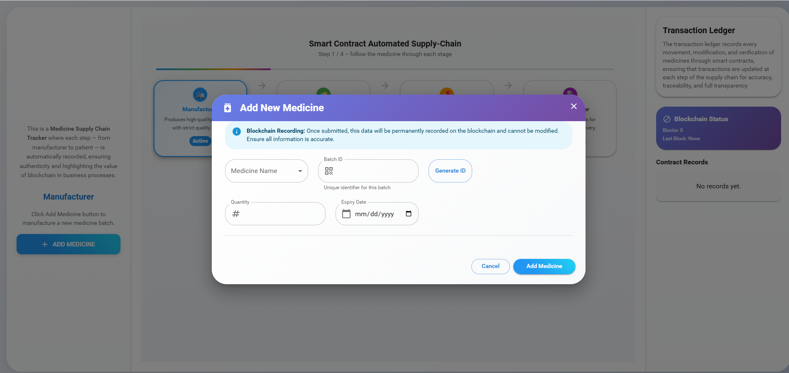

- 
Observe a new block being added to the ledger with all the details of the medicine. Then click the 'Next' button to move on to the next step.

  
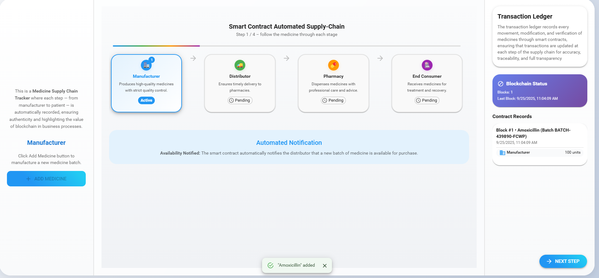

<b>
2. Distributor
</b>

The Distributor picks up the medicine from the manufacturer.

- 
Click the 'Receive Medicine' button, choose the quantity of medicine, and click 'Confirm Quantity' to buy medicines from the manufacturer.

  
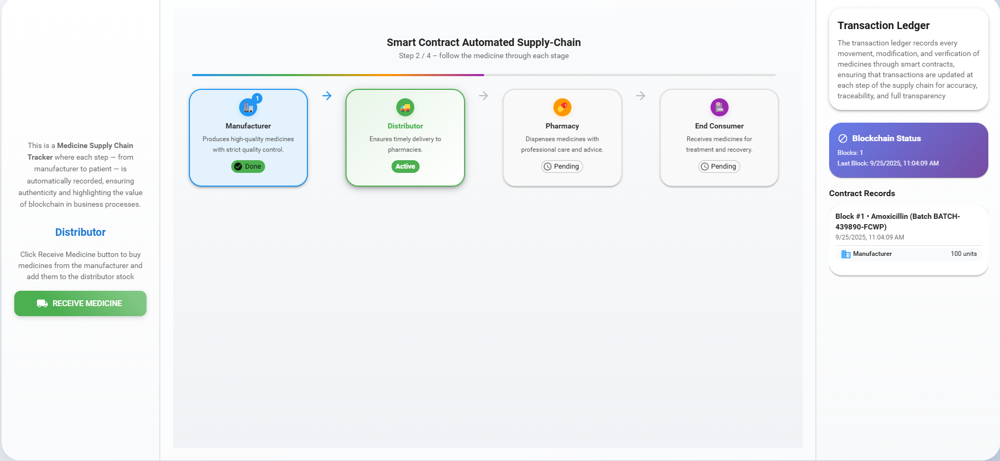

  
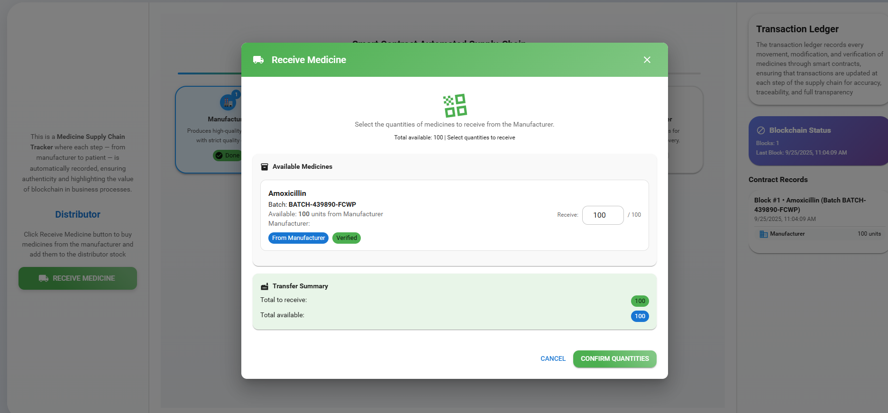

- 
Observe a new block being added to the ledger with all the details of the medicine. Then click the 'Next' button to move on to the next step.

  
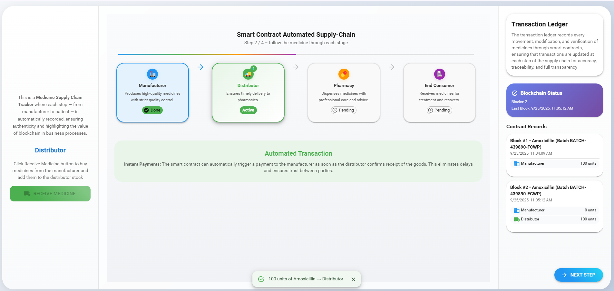

<b>
3. Pharmacy
</b>

- 
Click the 'Manage Stock' button, choose the medicine quantity, and click 'Confirm Quantities' to buy medicines from the distributor.

  
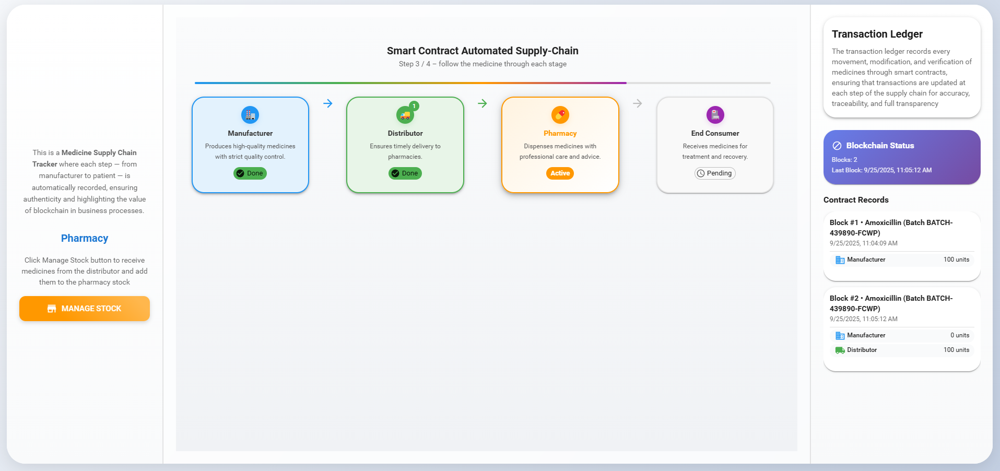

  
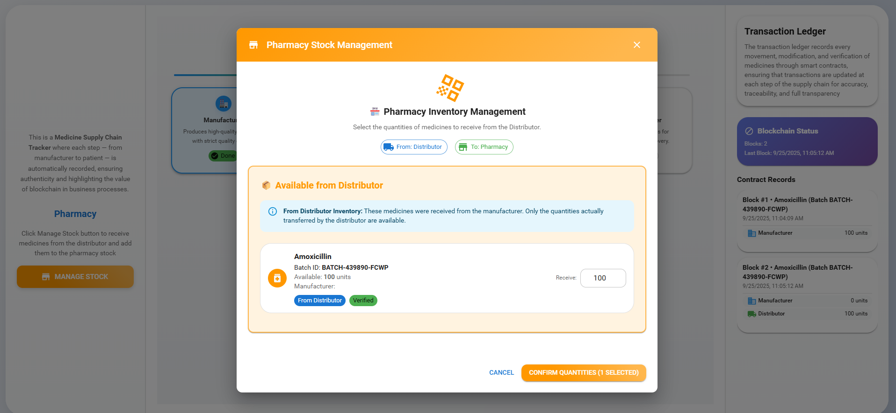

- 
Observe a new block being added to the ledger with all the details of the medicine. Then click the 'Next' button to move on to the next step.

  
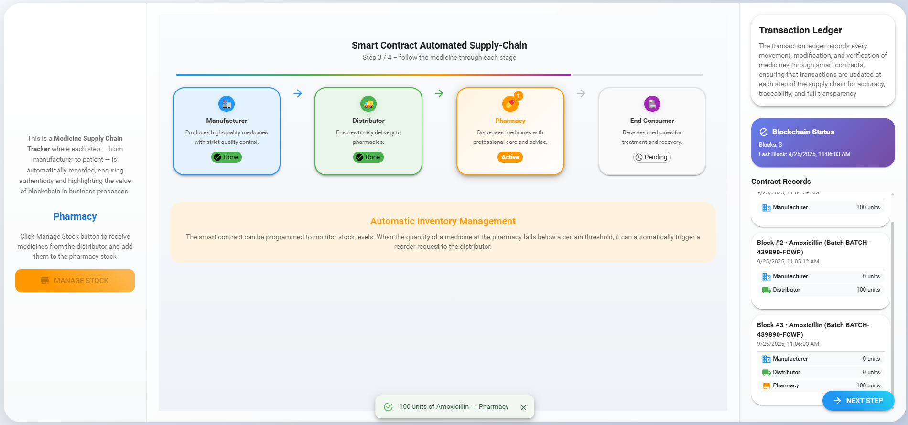

<b>
4. Sales
</b>

- 
Click the 'Manage Sales' button, choose a Recipient from the dropdown (Hospital, Outlet, Patient), select the quantity from the available stock, and click 'Add Recipient.' Users can add multiple recipients. Once recipients are added, click the 'Confirm All Sales' button to finalize the sale.

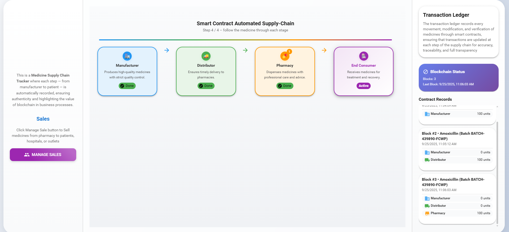

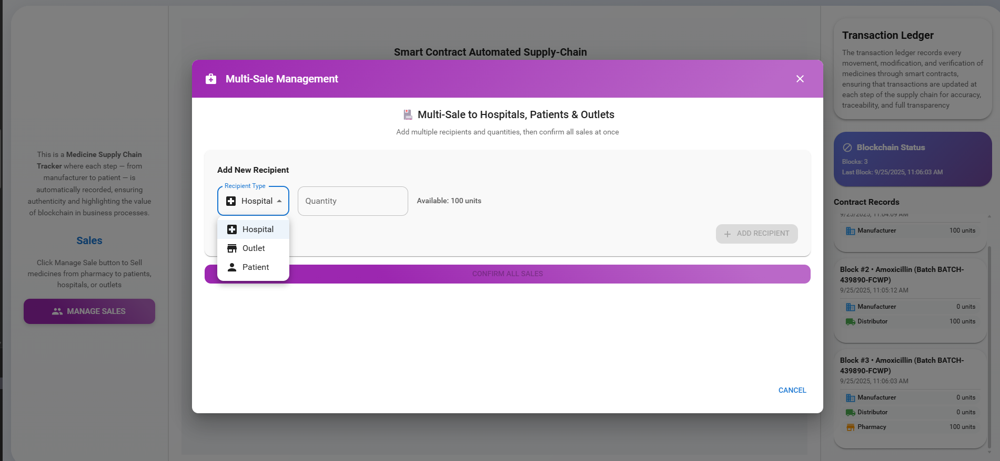

- 
Observe a new block being added to the ledger with all the details of the medicine.

  
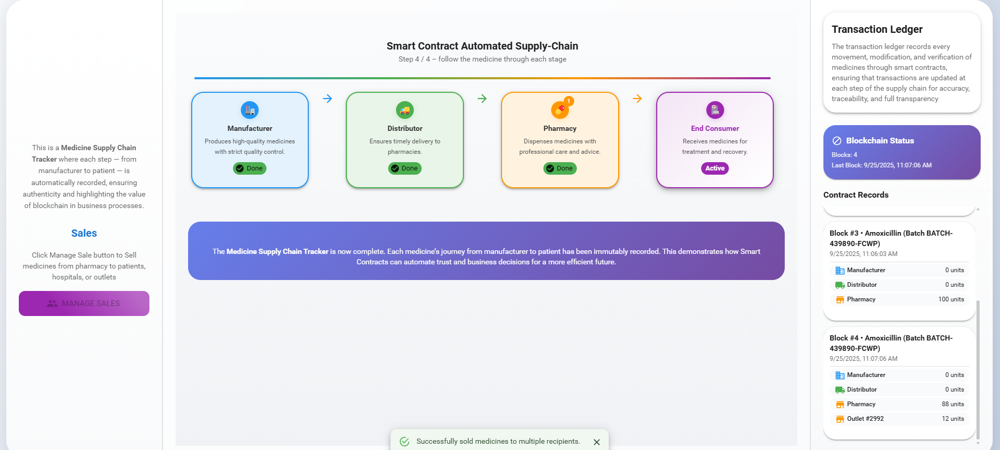

- 
Each transaction adds a block to the blockchain ledger, providing a tamper-proof record of the entire supply chain process.

